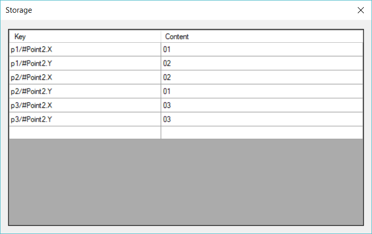

# examples-csharp/StructExample3Combined

A C# smart contract that implements a Storage-based persistence scheme for a class called `Point2`.

Sample output from the [Relfos/neo-debugger](https://github.com/Relfos/neo-debugger-tools)

Awesome debugging tool.
